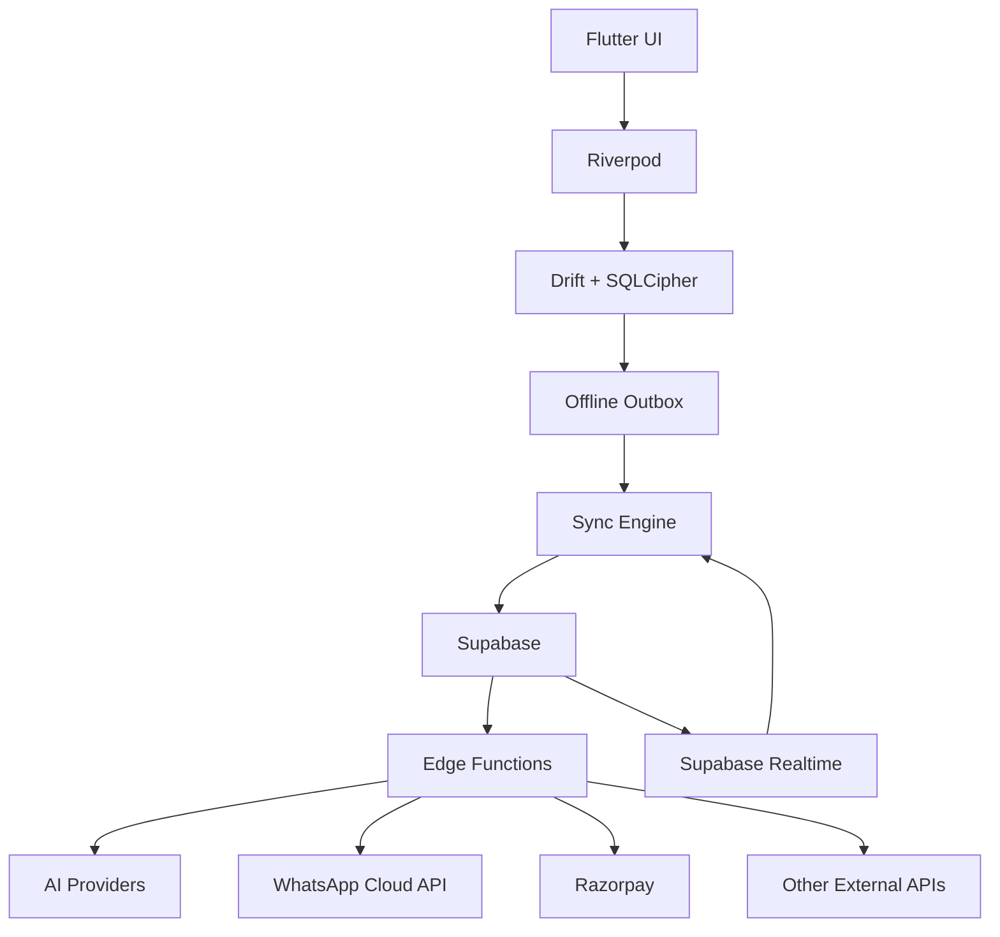

# FitKarma System Architecture

## 1. Canonical architecture



## 2. Client layers

- Presentation: Flutter widgets and screens.
- State: Riverpod feature/domain providers.
- Persistence: Drift repositories over SQLCipher.
- Sync: outbox worker with idempotent operations.
- Integrations: platform health APIs and secure backend bridges.

## 2.1 Project folder architecture & dependency direction

```text
lib/
├── app/                  # Application bootstrap, root widget, global observers
│   ├── bootstrap.dart
│   └── fitkarma_app.dart
├── core/                 # Shared foundational primitives & contracts (no feature imports)
│   ├── config/           # AppConfig, environment flags, secret validation
│   ├── constants/        # AppConstants, package identifiers
│   ├── database/         # Local database boundaries (Drift + SQLCipher contracts)
│   ├── errors/           # Failure primitives and FK-xxxx taxonomy
│   ├── services/         # Logging, telemetry, platform abstractions
│   └── sync/             # SyncEngine contracts and outbox boundaries
├── shared/               # Reusable UI primitives, theme tokens, Bento cards
│   └── presentation/     # Generic widgets, cards, dialogs (no feature imports)
└── features/             # Feature-driven modular domains
    ├── auth/             # Phone OTP, Google OAuth, session management
    ├── profile/          # User baseline, fitness goals, wellness/Dosha
    ├── dashboard/        # Daily Intelligence Package (DIP), home surface
    ├── nutrition/        # Indian food DB, portions, raw/cooked, Tadka, recipes
    ├── health_tracking/  # Steps, sleep, weight, mood, water, medications, vitals
    ├── family/           # Family Care Dashboard, consent, remote view
    ├── payments/         # Razorpay checkout, UPI AutoPay, entitlement state
    └── data_vault/       # DPDP privacy vault, export, cascading erasure
```

### Dependency direction rules

1. **Domain Isolation**: Domain entities, value objects, and repository interfaces must have zero dependencies on Flutter UI, data sources, or third-party SDKs.
2. **Inward Dependencies**: Presentation and Data layers depend on Domain. Presentation handles UI and Riverpod providers; Data implements Domain repository interfaces.
3. **Module Encapsulation**: A feature module must NEVER directly import internal implementations from a sibling feature module. Inter-feature coordination occurs via Domain interfaces, public facades, or shared application routing.
4. **Core / Shared Independence**: `core/` and `shared/` are strictly downstream foundations and must never import from `features/`.

## 3. Backend boundaries

### Supabase Postgres

Canonical relational data store with RLS on exposed user data. `pgvector` may support recipe embeddings where required.

### Edge Functions

Server-only responsibilities include AI provider routing, WhatsApp webhooks, payment provider verification, subscription entitlement updates, deletion orchestration and privileged integrations.

## 4. Offline sync

Every mutable entity needs a stable client ID or server-issued identifier plus an idempotency strategy. The sync engine should:

1. read pending outbox records;
2. submit only authorized mutations;
3. retry transient failures with backoff;
4. mark success only after server acknowledgement;
5. surface conflicts instead of silently overwriting material user changes.

Exact conflict rules are `PROPOSED` and vary by entity.

## 5. AI architecture

Use the server-side Groq router described in the main documentation. Candidate model roles are retained as source-supported architecture, while exact model versions remain configurable. Structured outputs should feed deterministic domain logic.

## 6. WhatsApp architecture

Inbound text/audio is received through webhook infrastructure. Media is fetched server-side, transcribed/parsed, normalized to the nutrition domain, and returned as a confirmation prompt before committing uncertain food data.

## 7. Payments

Razorpay is integrated server-side. The client receives only public identifiers and state needed to render the payment flow. Webhooks are verified and applied idempotently before entitlements are changed.

## 8. Health integrations

OS-level health aggregators are the primary first-stage integrations: Health Connect on Android and Apple Health/HealthKit on iOS. Each imported observation retains source metadata where the platform makes it available.

## 9. Security boundaries

- Client never holds provider secrets.
- Local health data is encrypted.
- Supabase RLS is mandatory.
- Privileged Edge Functions use least-privilege credentials.
- Family sharing is scoped and revocable.

## 10. Availability targets

No numeric SLO is currently confirmed. `PROPOSED`: define sync success, API latency, crash-free session and webhook processing objectives before production launch.
